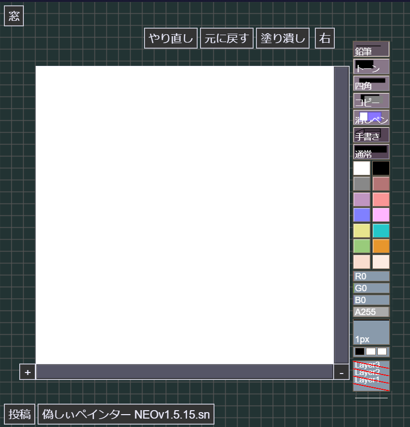

# Shi-PainterNEO

お絵かきペインター Shi-Painter (©2000-2004しぃちゃん) をhtml5化するプロジェクトです。

作者行方不明のため、許諾は取っていません。

しぃちゃんのホームページ（Vector）
[http://hp.vector.co.jp/authors/VA016309/](http://hp.vector.co.jp/authors/VA016309/)

PaintBBSのHTML5化ができるんだから、しぃぺいんたーもできるんじゃない？ということでやってみます。

-> [neo](https://github.com/funige/neo/)

あとあれだわ。cheerpjのロード待ち時間が長いのでなんとかしたかった。

## サンプル

[偽しぃペインターNEO](./sample/index.html)

## 対応環境 (NeoのREADMEより引用)

Chrome/FireFox/Safari/Edge iOS(Mobile Safari) ※ 最新のバージョンのみ

Windowsで線がうまく引けない場合は、以下をお試しください

- Chromeを使う
- wacomのタブレットを使用している場合は「デジタルインク(WindowsInk)を使用する」をオフにする

Firefox(59以降？)はタブレット関係のバグがあるらしく、線が乱れることがあるようです。
マルチプロセスを切ると症状が解消されるかもしれません。（about:configでbrowser.tabs.remote.autostartをFalse）

Chrome(80以降？)で横に長い線を引くとジェスチャーと誤認識される場合は、chrome://flags/#overscroll-history-navigation でジェスチャーを無効にするといいかもしれません。

## お絵かき掲示板の設置方法について

新しくお絵かき掲示板を設置したい方には、noReitaの利用をお勧めします。

- [noReira](https://oekakibbs.moe/) - noReita

POTI-boardももしかしたら対応するかもしれません。

- [POTI-board改公式サイト](https://pbbs.sakura.ne.jp/poti/) - POTI-board EVO

---

## 履歴

### [2022/04/08]

なぜかレイヤー2と3に描くことができない

### [2022/04/07]

- レイヤーを4枚にしようとして、文字を増やせた。
- ……いけるか？？？？

### [2022/03/28]

- レイヤーを4枚にしようとして、昨日よりましになった。

- appletタグを探して読み込むからそれで制限がかかってる気がするので、その辺を変えようと思う。

### [2022/03/27]

- レイヤーを4枚にしようとして、うまく動いていない。

### [2022/03/05]

- やっぱ今のneoから拡張しようと思った。

### [2021/08/06]

- importでいろいろいじれるぽい。→ダメくさい。
- neo.jsを直接書き換えるのは色々とアレなので、出力結果をさらに書き換える形にできないかなあ。

### [2021/07/23]

- とりあえず現在のNEO(1.15.12)の拡張から始めようと方向転換。
  - レイヤーを増やす
  - レイヤーの透明度
- あたりまでできれば「しぃぺNEO（仮）」くらい名乗れると思う。

### [2021/07/05]

- プロジェクト開始
- とりあえずVue.jsつかってみるかー
- いやCheeprJの結果から逆算するほうが早くね？
